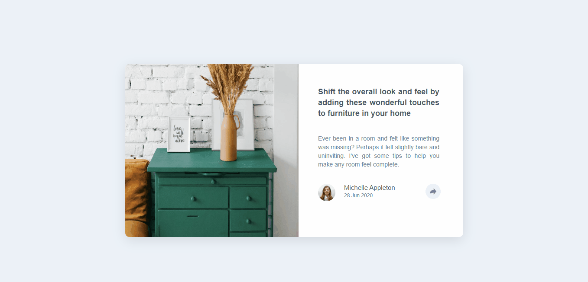
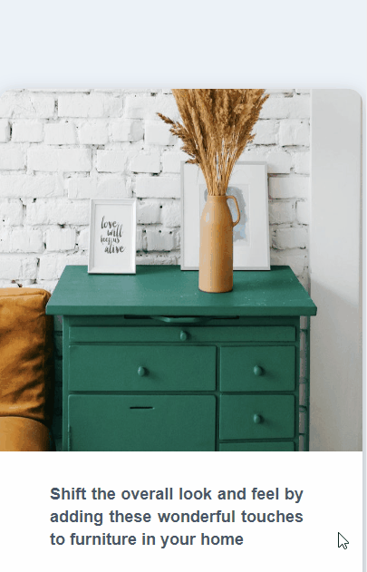

# Article Preview

### Desafio do FrontEnd Mentor de visualização de artigo com opção de compartilhamento ativa por Javascript.

## Sobre o desafio

O objetivo do desafio era criar uma página de visualização de um artigo usando HTML e CSS com a opção de compartilhamento sendo ativada por Javascript.

Em adição à proposta inicial, também me desafiei a realizar meu primeiro projeto solo de usando Javascript com um tempo ótimo, tendo concluído antes de 1h45min.

## Tecnologias Usadas

Para completar o desafio usei:
 - HTML
 - CSS
 - Javascript
 - Tags Semânticas
 - CSS Flexbox
 - Acessibilidade

## O Projeto Rodando

#### Versão Desktop

#### Versão Mobile
